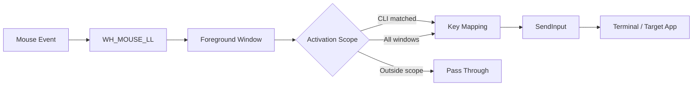

<div align="center">

# VibeKeys

### Make your mouse speak terminal.

A minimalist Windows utility that turns mouse buttons into focused keyboard actions for terminal-first workflows.

[](https://github.com/Adobiz/VibeKeys/releases)
[](https://github.com/Adobiz/VibeKeys/releases)
[](https://www.rust-lang.org/)
[](https://github.com/Adobiz/VibeKeys/releases/latest)

English | [中文](README_zh-CN.md) 

**Single EXE · Native Desktop UI · Real-time Mapping · CLI-aware**

</div>

---

VibeKeys provides a more intuitive mouse-driven experience for interactive AI Agent tools such as Codex CLI, Claude Code, and Kimi Code.

It captures mouse side buttons, detects the active foreground window, and injects keyboard actions via the Windows SendInput API — enabling smoother agent control without leaving your terminal.

## Highlights

|     | Feature | Description |
| --- | --- | --- |
| **01** | Native desktop app | UI, config, mouse capture, and backend logic are packaged into one Windows EXE. |
| **02** | Real-time mapping | Change a binding in the UI and it applies immediately. |
| **03** | Activation scope | Use mappings only in CLI windows, or enable them globally for all foreground apps. |
| **04** | Custom terminal allowlist | Add or remove terminal process names directly from the UI. |
| **05** | Mouse device detection | Inspect detected mouse devices, VID, PID, brand hints, and Raw Input paths. |
| **06** | Tray resident mode | Minimize to tray, restore from tray, close to exit. |
| **07** | Bilingual UI | Switch between Chinese and English from the desktop interface. |
| **08** | Local-first privacy | No account, no telemetry, no cloud sync. Everything stays on your machine. |

## Default Bindings

| Mouse input | Default action | Typical use |
| --- | --- | --- |
| Side Button 4 / X1 | `Up` | Move selection up |
| Side Button 5 / X2 | `Down` | Move selection down |
| Middle Button | `Enter` | Confirm current selection |

The desktop UI also supports actions such as `Left`, `Right`, `Tab`, `Escape`, `PageUp`, `PageDown`, `Home`, `End`, and `Space`.

## How It Works



In CLI-only mode, VibeKeys intercepts mapped mouse buttons only when the foreground process matches the terminal allowlist.

Default terminal allowlist:

- `WindowsTerminal.exe`
- `pwsh.exe`
- `powershell.exe`
- `cmd.exe`

## Desktop interface
The left sidebar provides three independent workspaces:

- **Bindings**: Toggle mapping on/off and choose actions for X1, X2, and the middle button.

- **Mouse devices**: View detected brand, VID, PID, and Raw Input device path.

- **Activation scope**: Switch between "CLI only" and "All windows".

The 中 / EN control on the left switches the UI language instantly. Page titles, navigation, action names, save status, and tooltips all switch together.

## Requirements

- Windows 10 or Windows 11
- Microsoft Edge WebView2 Runtime

## Installation

Download `VibeKeys.exe` from GitHub Releases and run it directly.

VibeKeys is a single EXE application. It does not require a separate browser window, local web server, HTML bundle, or external config file.

User config is stored at:

```text
%APPDATA%\VibeKeys\vibekeys.json
```

WebView2 runtime data is stored at:

```text
%LOCALAPPDATA%\VibeKeys\WebView2
```

## Quick Start

1. Download `VibeKeys.exe` from Releases.
2. Launch the desktop app.
3. Open the Bindings page and choose actions for X1, X2, and Middle Button.
4. Keep Activation Scope set to CLI Only for normal terminal-focused usage.
5. Open Windows Terminal and try it inside `Codex CLI`, `Claude Code`, or another interactive CLI.

When minimized, VibeKeys stays active in the system tray. Clicking the tray icon restores the window. Closing the window exits the app.

## Configuration

VibeKeys maintains its config automatically through the desktop UI.

Example config:

```json
{
  "enabled": true,
  "language": "en",
  "terminal_processes": [
    "WindowsTerminal.exe",
    "pwsh.exe",
    "powershell.exe",
    "cmd.exe"
  ],
  "scope": "cli",
  "bindings": {
    "middle": "enter",
    "x1": "up",
    "x2": "down"
  }
}
```

Supported `scope` values:

- `cli`: only active in allowlisted terminal processes.
- `all`: active in every foreground window.

## Diagnostic Commands

```powershell
cargo run -- detect
cargo run -- context
cargo run -- devices
cargo run -- inject down
cargo run -- init-config
cargo run -- run --debug
```

| Command | Purpose |
| --- | --- |
| `detect` | Print middle, X1, and X2 mouse events without injecting keys. |
| `context` | Print foreground window title, process name, PID, and terminal match status. |
| `devices` | List Raw Input mouse devices with brand hints and VID/PID data. |
| `inject <action>` | Inject one keyboard action into the current foreground window. |
| `init-config` | Generate a default config in the current directory. |
| `run --debug` | Print the full capture, context, mapping, and injection decision chain. |

## Project Structure

```text
src/
├─ capture.rs       # Low-level mouse hook and event capture
├─ config.rs        # Config, activation scope, persistence
├─ context.rs       # Foreground window and process detection
├─ desktop.rs       # Native window, WebView2, IPC, tray behavior
├─ devices.rs       # Raw Input device enumeration
├─ diagnostics.rs   # Debug output
├─ injector.rs      # SendInput keyboard injection
├─ icon_pixels.rs   # VK icon pixel source
├─ mapper.rs        # Mouse button to keyboard action mapping
└─ main.rs          # CLI and desktop entrypoint

ui/
└─ index.html       # Embedded desktop UI

build.rs            # Generates and embeds Windows icon resources
```

## FAQ

### Do users need Rust?

No. Rust is only required for building from source. End users only need Windows and WebView2 Runtime.

### Why are my browser side buttons being changed?

Check Activation Scope. If it is set to All Windows, VibeKeys will map buttons globally. Switch back to CLI Only to preserve normal browser forward/back behavior.

### Why does injection fail in an elevated terminal?

Windows may block lower-privilege processes from injecting input into elevated windows. Run VibeKeys with the same privilege level as the target terminal.

### Why does my mouse brand show as Unknown?

Brand detection is based on hardware VID hints. It is only informational and does not affect button capture or mapping.

## Privacy

VibeKeys does not require an account, does not upload config, and does not include telemetry. Window detection, mouse capture, device enumeration, and config storage all happen locally.

## Current Scope
Not included yet:

- macOS or Linux support

## License
MIT © Adobiz

---

<div align="center">

Built for people deep in the flow of vibe coding.

</div>
