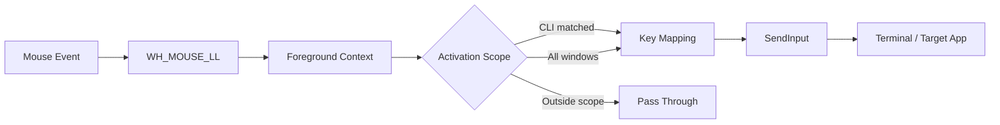

<div align="center">

# VibeKeys

### Make your mouse speak terminal.

把鼠标侧键变成终端里的方向感。  
一个轻量、原生、Windows-first 的鼠标键位映射工具。

[](#系统要求)
[](https://www.rust-lang.org/)
[](#当前边界)

**Single EXE · Native Desktop UI · Real-time Mapping · CLI-aware**

</div>

---

VibeKeys 为 `codex CLI`、`claude code`、`kimi code` 等交互式 Agent 工具提供一套更简便的鼠标操作方式。它捕获鼠标侧键，识别当前前台窗口，并通过 Windows `SendInput` 注入键盘动作。

默认情况下，映射只在终端窗口中生效。切回浏览器或其他软件时，鼠标仍保持原来的前进、后退行为。

## Highlights

| | 能力 | 说明 |
|---|---|---|
| **01** | 原生桌面应用 | 前端、配置与捕获后端封装在同一个 EXE 中，不启动浏览器或本地 Web 服务 |
| **02** | 实时键位映射 | 修改映射后自动保存，并立即作用于正在运行的捕获线程 |
| **03** | 生效范围控制 | 可选择“仅 CLI”或“所有窗口”，默认保护浏览器等普通软件 |
| **04** | 鼠标设备识别 | 读取 Raw Input 设备信息，展示品牌、VID、PID 与设备路径 |
| **05** | 可诊断 | 提供捕获、窗口识别、键盘注入和完整调试链路 |
| **06** | 托盘常驻 | 最小化后隐藏到系统托盘，点击托盘图标即可恢复窗口 |
| **07** | 中英双语 | 中文与 English 一键切换，语言偏好随配置持久化 |
| **08** | 统一品牌图标 | 内容区、标题栏、任务栏、托盘与 EXE 使用同一套 VK 图标 |

## 默认映射

| 鼠标输入 | 默认动作 | 常见用途 |
|---|---:|---|
| 侧键 4 / X1 | `Up` | 上移选择项 |
| 侧键 5 / X2 | `Down` | 下移选择项 |
| 滚轮中键 | `Enter` | 确认当前选择 |

桌面界面还支持：`Left`、`Right`、`Tab`、`Escape`、`PageUp`、`PageDown`、`Home`、`End` 和 `Space`。

## 工作方式



在“仅 CLI”模式下，VibeKeys 只会拦截白名单终端中的已映射按键。窗口不匹配、映射被关闭或注入失败时，原始鼠标事件会继续传递。

默认终端白名单：

- `WindowsTerminal.exe`
- `pwsh.exe`
- `powershell.exe`
- `cmd.exe`

## 桌面界面

左侧导航提供三个独立工作区：

- **键位映射 / Bindings**：启停映射，并为 X1、X2 与中键选择动作。
- **鼠标设备 / Mouse devices**：查看系统检测到的品牌、VID、PID 和 Raw Input 设备路径。
- **生效范围 / Activation scope**：在“仅 CLI”和“所有窗口”之间切换。

左侧的 `中 / EN` 控件可以即时切换界面语言。页面标题、导航、动作名称、保存状态和提示信息会一起切换。

## 安装

### 使用发布版

从 GitHub Releases 获取最新的 `VibeKeys.exe`，放在任意可写目录后直接运行。VibeKeys 是单 EXE 应用，不需要额外携带 HTML、DLL 或配置文件。

首次运行后，用户配置与 WebView2 数据会写入 Windows 用户数据目录，不会污染 EXE 所在目录。

### 从源码构建

```powershell
cd vibekeys
cargo build --release
```

构建产物位于 `target\release\vibekeys.exe`。

## 快速开始

1. 获取或构建 `VibeKeys.exe`。
2. 双击启动桌面应用。
3. 在“键位映射”中选择动作。
4. 在“生效范围”中保留“仅 CLI”，或按需选择“所有窗口”。
5. 打开 Windows Terminal，在 `codex CLI` 或 `claude code` 中按下鼠标侧键。

最小化 VibeKeys 会隐藏到系统托盘并继续捕获；点击托盘图标或再次启动 EXE 可以恢复窗口。点击标题栏关闭按钮或托盘菜单中的“退出”会直接结束程序。配置保存在：

```text
%APPDATA%\VibeKeys\vibekeys.json
```

WebView2 运行数据保存在 `%LOCALAPPDATA%\VibeKeys\WebView2`，EXE 所在目录不会产生缓存文件。

## 托盘行为

| 操作 | 结果 |
|---|---|
| 点击最小化 | 隐藏主窗口并继续在托盘运行 |
| 左键点击托盘图标 | 恢复并聚焦主窗口 |
| 再次启动 EXE | 恢复现有实例，不重复挂载鼠标钩子 |
| 点击标题栏关闭 | 直接结束程序 |
| 托盘菜单“退出” | 直接结束程序 |

## 配置

桌面界面会自动维护配置。文件结构如下：

```json
{
  "enabled": true,
  "language": "zh",
  "terminal_processes": [
    "WindowsTerminal.exe",
    "pwsh.exe",
    "powershell.exe",
    "cmd.exe"
  ],
  "scope": "cli",
  "bindings": {
    "middle": "enter",
    "x1": "up",
    "x2": "down"
  }
}
```

`scope` 可选值：

- `cli`：只在终端白名单中生效，推荐使用。
- `all`：在所有前台窗口中生效，包括浏览器和桌面软件。

`language` 可选值为 `zh` 或 `en`，也可以直接在桌面界面左侧切换。

`terminal_processes` 是“仅 CLI”模式使用的进程白名单。可直接在“生效范围”页面添加或移除进程；输入时省略 `.exe` 也可以，修改会自动保存并立即生效。

## 隐私

VibeKeys 不需要账户、不上传配置，也不包含遥测。窗口识别、鼠标捕获、设备枚举和配置读写都在本机完成。

## 诊断命令

<details>
<summary><strong>展开 CLI 工具箱</strong></summary>

```powershell
cargo run -- detect
cargo run -- context
cargo run -- devices
cargo run -- inject down
cargo run -- init-config
cargo run -- run --debug
```

| 命令 | 用途 |
|---|---|
| `detect` | 只监听并打印中键、X1、X2 事件，不注入按键 |
| `context` | 打印前台窗口标题、进程名、PID 与终端识别结果 |
| `devices` | 枚举 Raw Input 鼠标设备，并尝试识别品牌与 VID/PID |
| `inject <action>` | 向当前前台窗口注入单个键盘动作 |
| `init-config` | 在当前目录生成默认配置 |
| `run --debug` | 输出捕获、上下文、映射和注入的完整决策链 |

</details>

## 开发

### 系统要求

- Windows 10 或 Windows 11
- Rust stable toolchain
- Microsoft Edge WebView2 Runtime

Windows 10/11 通常已包含 WebView2 Runtime。

## 项目结构

```text
src/
├── capture.rs       # 低级鼠标钩子与事件拦截
├── config.rs        # 配置、范围与持久化
├── context.rs       # 前台窗口与进程识别
├── desktop.rs       # 原生窗口、WebView2 与进程内 IPC
├── devices.rs       # Raw Input 设备枚举
├── diagnostics.rs   # 调试输出
├── injector.rs      # SendInput 键盘注入
├── icon_pixels.rs   # VK 图标像素源
├── mapper.rs        # 鼠标按钮与键盘动作
└── main.rs          # CLI 与桌面入口

ui/
└── index.html       # 嵌入 EXE 的桌面界面

build.rs             # 生成并嵌入多尺寸 Windows 图标资源
```

## 常见问题

### 为什么浏览器里的侧键也被改变了？

检查“生效范围”是否选择了“所有窗口”。切换回“仅 CLI”后，非终端窗口会收到原始鼠标事件。

### 为什么托盘图标没有显示在任务栏右侧？

Windows 可能把新图标放入 `^` 隐藏图标区域。也可以再次启动 `VibeKeys.exe`，现有托盘实例会恢复主窗口。

### 为什么无法操作管理员权限运行的终端？

Windows 完整性级别可能阻止普通权限进程向高权限窗口注入输入。让 VibeKeys 与目标终端处于相同权限级别后再试。

### 为什么窗口无法启动？

确认系统已安装 Microsoft Edge WebView2 Runtime。Windows 10/11 通常自带该组件，也可以从微软官方安装程序修复。

### 鼠标品牌显示为 Unknown 会影响使用吗？

不会。品牌只是根据设备 VID 做的辅助识别，按键捕获与映射不依赖品牌名称。

## 贡献

Issue 和 Pull Request 都欢迎。提交问题时，建议附上：

- Windows 版本与终端名称
- `cargo run -- devices` 的 VID/PID 信息
- `cargo run -- run --debug` 中与问题相关的诊断输出
- 鼠标侧键在浏览器或终端中的实际表现

## 当前边界

目前没有 macOS/Linux 支持。

## License
MIT License.

Copyright (c) 2026 Adobiz

---

<div align="center">

为重度 vibe coding 而生。

</div>
